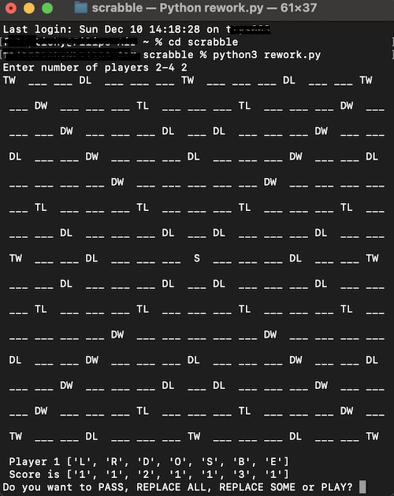
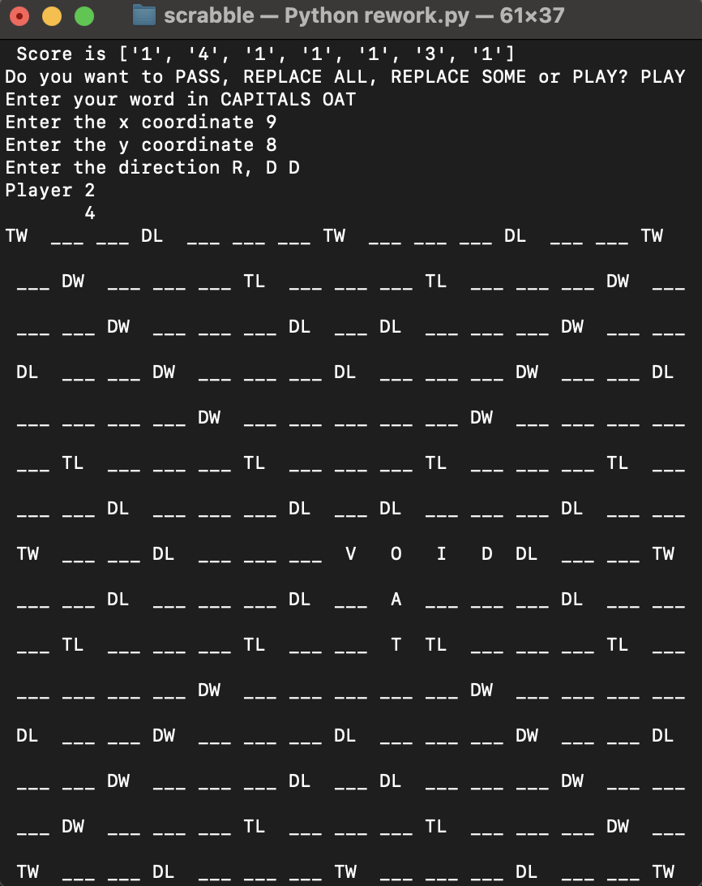

[](https://opensource.org/licenses/MIT)
# <p align="center">SCRABBLE IN TERMINAL</p>

Hey all this is my first serious project in python. It's made as a part of my seminar work at high school. Feel free to post any issues.  
Have fun!


## Sections
[How to start](#how-to-start)  
[How to Play](#how-to-play)  
[Preview](#preview)

## How to start

- Start by cloning repository to your machine:
```git 
git clone https://github.com/phillosz/scrabble.git
```
- Next navigate to your terminal (either in vscode or native) and type:
```bash
cd scrabble
```
- After that run:
```bash
python3 rework.py
```

Make sure that you have [python](https://www.python.org/downloads/) downloaded on your machine.

## How to play

Board size is 15x15, so the center is at 8,8 coordiantions. All your inputs are either in ***CAPSLOCK*** or ***numbers***.   
To questions mentioning jokers please respond with ***YES or NO***.  
To questions such as directions or whether you want to replace letters or not respond with ***exactly the word or letter***.  
It is possible that you will get stuck if you for example realize that you cannot make any word. In that case press ***Control + C***.  

## Preview
<div style="display: flex;">
  
  
</div>

